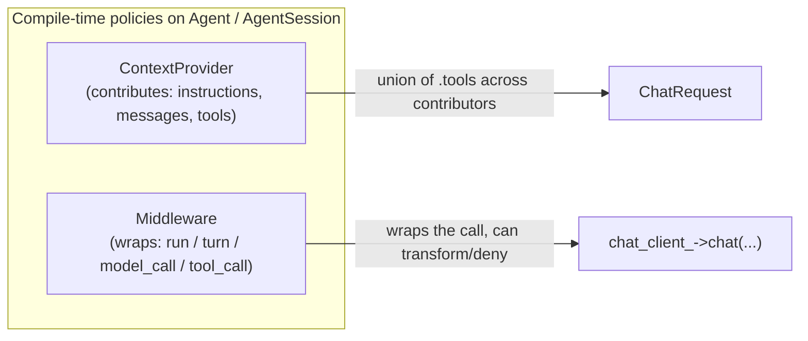
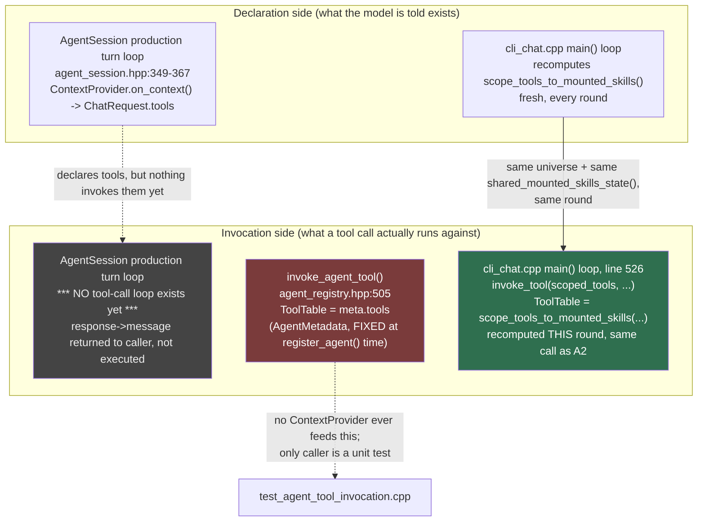

# Tool & skill context/invocation — as-built, with a sync check on `invoke_agent_tool`

**Compiled:** 2026-08-10 · **Status:** as-built trace, not a spec — cites the RFC/file each box comes
from; when this disagrees with the code, the code (and the RFC it cites) wins, fix this doc.

Grew out of a direct question: does `invoke_agent_tool()` (`include/agentengine/core/agent_registry.hpp:505`)
stay in sync with the mount-state-dependent tool set a `ContextProvider` declares to the model? Short
answer up front: **no — because it isn't part of that flow at all.** It's a third, structurally separate
path. Details below.

---

## 1. Two extension-point shapes (027-Vocabulary-and-Naming.md)

| Shape | Term | What it does | Where |
|---|---|---|---|
| Additive | **`ContextProvider`** (contributor/provider pattern) | Contributes `instructions`/`messages`/`tools` to the context assembled before a model call. Never wraps or denies a call. | `core/context_provider.hpp` |
| Wrapping | **`Middleware`** (interceptor pattern) | Wraps a run/turn/model-call/tool-call; can transform or short-circuit. | `core/agent.hpp` (002 §5) |

Both are **policies** — Alexandrescu-style policy-based design — plugged in as template parameters on
`Agent`/`AgentSession`. This doc is about the `ContextProvider` side, specifically the `tools` field.



---

## 2. `ContextContribution.tools` — the declaration side

`ContextContribution` (`context_provider.hpp:33-37`) deliberately mirrors MAF's `AIContext` shape: a
provider isn't limited to text.

```cpp
struct ContextContribution {
    std::optional<std::string>  instructions;
    std::vector<Message>        messages;
    std::vector<ToolDescriptor> tools;   // <-- same ToolDescriptor type tool_pipeline.hpp uses
};
```

`SkillsProvider` (§8b/§8c of 009) deliberately does **not** populate `.tools` — it mounts skill files
read-only into the worktree and advertises only a name+description; the agent reads a skill with
ordinary file ops, no `load_skill` meta-tool (a recorded divergence from MAF, ADR-024). But the seam is
general: `tools/cli_chat.cpp`'s own `ToolDeclaringHistoryProvider` (composing a `SkillsProvider`) *does*
populate `.tools`, computed fresh every turn:

```cpp
// cli_chat.cpp on_context(), every turn:
auto const universe = ToolTable::from_tools<ExecuteCodeTool, MountSkillTool>();
auto const scoped = scope_tools_to_mounted_skills(
    universe, skills_.allowed_tool_names_for(shared_mounted_skills_state().all()),
    {std::string(MountSkillTool::name)});
contribution.tools = scoped.descriptors();
```

`agent_session.hpp:367` forwards this into the real request: `ChatRequest{contribution->messages,
contribution->tools}` — previously (per that line's own comment) `.tools` had "no destination" and was
silently discarded; that's now fixed.

---

## 3. Three separate tool-invocation paths — this is the actual finding



### Path 1 — `AgentSession`'s real production turn loop
`agent_session.hpp` makes exactly **one model call per run** (own comment, lines 397-400: "no
tool-call loop exists yet"). It declares `contribution.tools` into the `ChatRequest`, gets back
`response->message` (which may itself contain a `ToolCall` content item), and returns that to the
caller — it never invokes anything. Declaration exists; there is no matching invocation step to be
"in sync" or "out of sync" with, because none runs here yet.

### Path 2 — `invoke_agent_tool()`
```cpp
// agent_registry.hpp:505-510
inline ToolResult invoke_agent_tool(AgentMetadata const& meta, ToolCallRequest const& request,
                                     EffectContext& ctx, ApprovalDecider const& approve = {},
                                     ToolInvocationAudit* audit_out = nullptr) {
    CapabilitySet const ceiling = CapabilitySet::grant_root(meta.capability_ceiling);
    return invoke_tool(meta.tools, ceiling, request, ctx, approve, audit_out);
}
```
`meta.tools` is `AgentMetadata::tools` (`agent_registry.hpp:57`) — a `ToolTable` compiled **once**, at
`register_agent<A>()` time, from the agent's declared `Tools<...>` policy. `AgentMetadata` is 002 §1's
read-only compiled table: no request-scoped state, nothing mount-aware, nothing that changes for the
agent's lifetime. Its only caller anywhere in the tree is `test_agent_tool_invocation.cpp`, proving M2
Phase E's exit criterion for **statically declared** native tools — no `SkillsProvider`, no
`shared_mounted_skills_state()`, no `scope_tools_to_mounted_skills()` anywhere in that test.

### Path 3 — `cli_chat.cpp`'s live e2e loop
```cpp
// main(), every round — cli_chat.cpp:499-502, comment verbatim:
// "Recomputed fresh EVERY round from the SAME live shared_mounted_skills_state() that
//  ToolDeclaringHistoryProvider::on_context() just used to build what was declared to the
//  model THIS round ... Never a differently-scoped table than what was just declared."
auto const round_universe = ToolTable::from_tools<ExecuteCodeTool, MountSkillTool>();
auto const scoped_tools = scope_tools_to_mounted_skills(
    round_universe, startup_skills.allowed_tool_names_for(shared_mounted_skills_state().all()),
    {std::string(MountSkillTool::name)});
...
ToolResult r = invoke_tool(scoped_tools, held, req, exec_ctx, nullptr);   // line 526
```
This is the one path that actually satisfies `skill_tool_scoping.hpp`'s own warning: declaration
(`on_context()`, §2 above) and invocation (`main()`'s loop) call `scope_tools_to_mounted_skills` with
the *same inputs* (`ToolTable::from_tools<ExecuteCodeTool, MountSkillTool>()`, the same
`shared_mounted_skills_state().all()`) on the *same cadence* (once per turn / once per round). Neither
side caches a table across a round boundary. This is why it stays in sync — by hand-written
construction in `cli_chat.cpp`, not by any shared library guarantee.

```mermaid
sequenceDiagram
    participant M as Model (OpenAI chat client)
    participant OC as ToolDeclaringHistoryProvider.on_context()
    participant State as shared_mounted_skills_state()
    participant Loop as main() invocation loop

    Note over OC,Loop: Every turn/round independently calls<br/>scope_tools_to_mounted_skills(universe, allowed_tool_names_for(State.all()))
    OC->>State: read mounted skill names
    OC->>OC: scoped = scope_tools_to_mounted_skills(...)
    OC->>M: ChatRequest{messages, scoped.descriptors()}
    M-->>Loop: response with ToolCall(s)
    Loop->>State: read mounted skill names (same call, same round)
    Loop->>Loop: scoped_tools = scope_tools_to_mounted_skills(...)
    Loop->>Loop: invoke_tool(scoped_tools, held, req, ctx)
    Note over Loop: If a mount_skill call landed this round,<br/>State changed — NEXT round's scoped set reflects it,<br/>never THIS round's, by construction (recomputed once per side, per round)
```

---

## 4. Sync verdict

**`invoke_agent_tool()` does not stay in sync with the skill-mount-scoped declaration, because it
was never wired into that flow to begin with** — it draws its `ToolTable` from `AgentMetadata.tools`,
a value fixed at `register_agent<A>()` time, structurally incapable of reflecting a `SkillsProvider`'s
runtime mount state. There is no divergence *bug* today: the two mechanisms are simply never used for
the same tool set in the current tree (`invoke_agent_tool` → static agent-declared tools only, proven
by a unit test with no skills involved; `scope_tools_to_mounted_skills` + `invoke_tool` → the dynamic,
mount-aware path, proven live by `cli_chat.cpp` / `test_agent_session_skills_live_e2e.cpp`).

The risk is forward-looking, not present: if `AgentSession`'s production turn loop later grows the
tool-call loop it doesn't have yet (closing the Path 1 gap above), whoever wires it must pick one of
these two invocation shapes deliberately —

- route through `scope_tools_to_mounted_skills`, recomputed at invocation time from the same live
  state `on_context()` just used (Path 3's pattern), or
- route through `invoke_agent_tool`/`AgentMetadata.tools` for agent-declared-only tools with no skill
  involvement (Path 2's pattern) —

and never let a skill-scoped tool be reachable through `invoke_agent_tool`, since `AgentMetadata` has
no mount-state input to stay synced with even in principle. This is exactly the "declaration ≠
invocation-time authorization" trap `skill_tool_scoping.hpp`'s top comment names directly, restated
here against a concrete third path (`invoke_agent_tool`) that comment doesn't itself mention.
