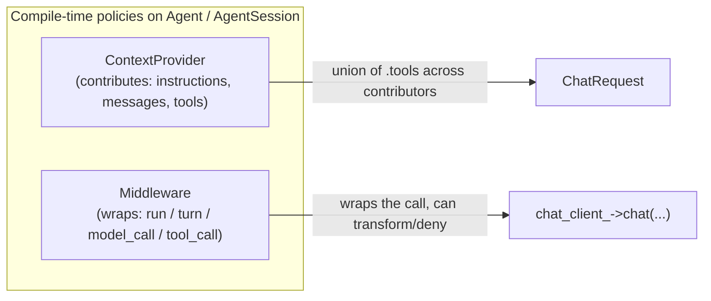
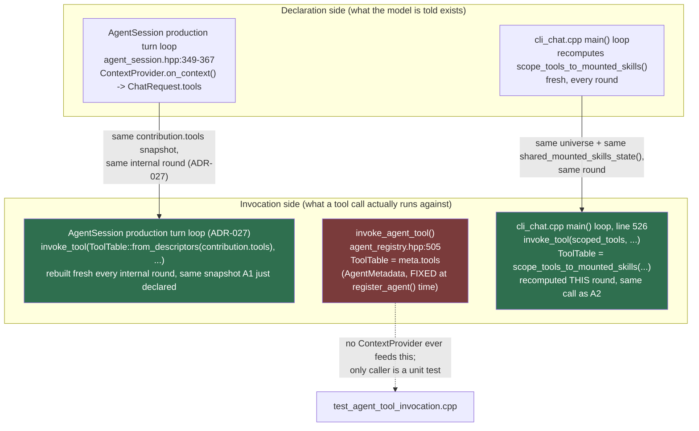

# Tool & skill context/invocation — as-built, with a sync check on `invoke_agent_tool`

**Compiled:** 2026-08-10 · **Status:** as-built trace, not a spec — cites the RFC/file each box comes
from; when this disagrees with the code, the code (and the RFC it cites) wins, fix this doc.

**Correction (2026-08-11):** `decisions/ADR-027-agent-session-tool-call-loop.md` (Judged) put a real
tool-call loop inside `AgentSession::handle()` itself, the day after this doc was compiled. Path 1
below described that loop as not existing ("`*** NO tool-call loop exists yet ***`") — that framing
is now wrong; see the correction inline at Path 1 and the updated §4 verdict. Everything else in this
doc (the `ContextProvider`/`Middleware` shapes, `ContextContribution.tools`, Paths 2 and 3) is
unaffected and still accurate.

Grew out of a direct question: does `invoke_agent_tool()` (`include/agentengine/core/agent_registry.hpp:505`)
stay in sync with the mount-state-dependent tool set a `ContextProvider` declares to the model? Short
answer up front: **no — because it isn't part of that flow at all.** It's a third, structurally separate
path. Details below.

---

## 1. Two extension-point shapes (027-Vocabulary-and-Naming.md)

| Shape | Term | What it does | Where |
|---|---|---|---|
| Additive | **`ContextProvider`** (contributor/provider pattern) | Contributes `instructions`/`messages`/`tools` to the context assembled before a model call. Never wraps or denies a call. | `core/context_provider.hpp` |
| Wrapping | **`Middleware`** (interceptor pattern) | Wraps a run/turn/model-call/tool-call; can transform or short-circuit. | `core/agent.hpp` (002 §5) |

Both are **policies** — Alexandrescu-style policy-based design — plugged in as template parameters on
`Agent`/`AgentSession`. This doc is about the `ContextProvider` side, specifically the `tools` field.



---

## 2. `ContextContribution.tools` — the declaration side

`ContextContribution` (`context_provider.hpp:33-37`) deliberately mirrors MAF's `AIContext` shape: a
provider isn't limited to text.

```cpp
struct ContextContribution {
    std::optional<std::string>  instructions;
    std::vector<Message>        messages;
    std::vector<ToolDescriptor> tools;   // <-- same ToolDescriptor type tool_pipeline.hpp uses
};
```

`SkillsProvider` (§8b/§8c of 009) deliberately does **not** populate `.tools` — it mounts skill files
read-only into the worktree and advertises only a name+description; the agent reads a skill with
ordinary file ops, no `load_skill` meta-tool (a recorded divergence from MAF, ADR-024). But the seam is
general: `tools/cli_chat.cpp`'s own `ToolDeclaringHistoryProvider` (composing a `SkillsProvider`) *does*
populate `.tools`, computed fresh every turn:

```cpp
// cli_chat.cpp on_context(), every turn:
auto const universe = ToolTable::from_tools<ExecuteCodeTool, MountSkillTool>();
auto const scoped = scope_tools_to_mounted_skills(
    universe, skills_.allowed_tool_names_for(shared_mounted_skills_state().all()),
    {std::string(MountSkillTool::name)});
contribution.tools = scoped.descriptors();
```

`agent_session.hpp:367` forwards this into the real request: `ChatRequest{contribution->messages,
contribution->tools}` — previously (per that line's own comment) `.tools` had "no destination" and was
silently discarded; that's now fixed.

---

## 3. Three separate tool-invocation paths — this is the actual finding



### Path 1 — `AgentSession`'s real production turn loop
**(Corrected 2026-08-11 — was accurate on 2026-08-10, no longer is.)** As of
`decisions/ADR-027-agent-session-tool-call-loop.md` (Judged), one `StartRun` ask resolves a whole
multi-round tool conversation inside `AgentSession::handle()` itself: it declares `contribution.tools`
into the `ChatRequest` exactly as before, but a returned `ToolCall` is now extracted, capability/
approval-checked, and invoked for real via `invoke_tool(ToolTable::from_descriptors(contribution
.tools), ...)` — the SAME `ContextContribution` snapshot that round's declaration used, rebuilt fresh
every internal round rather than cached across one. This is, structurally, Path 3's own discipline
("declaration and invocation call the scoping logic with the same inputs, on the same cadence"),
independently arrived at for this path — closing exactly the "declared ≠ invocable" gap this doc's §4
originally flagged as a forward-looking risk. Declaration and invocation ARE in sync here now, by the
same kind of construction Path 3 uses, not by accident.

### Path 2 — `invoke_agent_tool()`
```cpp
// agent_registry.hpp:505-510
inline ToolResult invoke_agent_tool(AgentMetadata const& meta, ToolCallRequest const& request,
                                     EffectContext& ctx, ApprovalDecider const& approve = {},
                                     ToolInvocationAudit* audit_out = nullptr) {
    CapabilitySet const ceiling = CapabilitySet::grant_root(meta.capability_ceiling);
    return invoke_tool(meta.tools, ceiling, request, ctx, approve, audit_out);
}
```
`meta.tools` is `AgentMetadata::tools` (`agent_registry.hpp:57`) — a `ToolTable` compiled **once**, at
`register_agent<A>()` time, from the agent's declared `Tools<...>` policy. `AgentMetadata` is 002 §1's
read-only compiled table: no request-scoped state, nothing mount-aware, nothing that changes for the
agent's lifetime. Its only caller anywhere in the tree is `test_agent_tool_invocation.cpp`, proving M2
Phase E's exit criterion for **statically declared** native tools — no `SkillsProvider`, no
`shared_mounted_skills_state()`, no `scope_tools_to_mounted_skills()` anywhere in that test.

### Path 3 — `cli_chat.cpp`'s live e2e loop
```cpp
// main(), every round — cli_chat.cpp:499-502, comment verbatim:
// "Recomputed fresh EVERY round from the SAME live shared_mounted_skills_state() that
//  ToolDeclaringHistoryProvider::on_context() just used to build what was declared to the
//  model THIS round ... Never a differently-scoped table than what was just declared."
auto const round_universe = ToolTable::from_tools<ExecuteCodeTool, MountSkillTool>();
auto const scoped_tools = scope_tools_to_mounted_skills(
    round_universe, startup_skills.allowed_tool_names_for(shared_mounted_skills_state().all()),
    {std::string(MountSkillTool::name)});
...
ToolResult r = invoke_tool(scoped_tools, held, req, exec_ctx, nullptr);   // line 526
```
This is the one path that actually satisfies `skill_tool_scoping.hpp`'s own warning: declaration
(`on_context()`, §2 above) and invocation (`main()`'s loop) call `scope_tools_to_mounted_skills` with
the *same inputs* (`ToolTable::from_tools<ExecuteCodeTool, MountSkillTool>()`, the same
`shared_mounted_skills_state().all()`) on the *same cadence* (once per turn / once per round). Neither
side caches a table across a round boundary. This is why it stays in sync — by hand-written
construction in `cli_chat.cpp`, not by any shared library guarantee.

```mermaid
sequenceDiagram
    participant M as Model (OpenAI chat client)
    participant OC as ToolDeclaringHistoryProvider.on_context()
    participant State as shared_mounted_skills_state()
    participant Loop as main() invocation loop

    Note over OC,Loop: Every turn/round independently calls<br/>scope_tools_to_mounted_skills(universe, allowed_tool_names_for(State.all()))
    OC->>State: read mounted skill names
    OC->>OC: scoped = scope_tools_to_mounted_skills(...)
    OC->>M: ChatRequest{messages, scoped.descriptors()}
    M-->>Loop: response with ToolCall(s)
    Loop->>State: read mounted skill names (same call, same round)
    Loop->>Loop: scoped_tools = scope_tools_to_mounted_skills(...)
    Loop->>Loop: invoke_tool(scoped_tools, held, req, ctx)
    Note over Loop: If a mount_skill call landed this round,<br/>State changed — NEXT round's scoped set reflects it,<br/>never THIS round's, by construction (recomputed once per side, per round)
```

---

## 4. Sync verdict

**`invoke_agent_tool()` does not stay in sync with the skill-mount-scoped declaration, because it
was never wired into that flow to begin with** — it draws its `ToolTable` from `AgentMetadata.tools`,
a value fixed at `register_agent<A>()` time, structurally incapable of reflecting a `SkillsProvider`'s
runtime mount state. There is no divergence *bug* today: the two mechanisms are simply never used for
the same tool set in the current tree (`invoke_agent_tool` → static agent-declared tools only, proven
by a unit test with no skills involved; `scope_tools_to_mounted_skills` + `invoke_tool` → the dynamic,
mount-aware path, proven live by `cli_chat.cpp` / `test_agent_session_skills_live_e2e.cpp`).

**Resolved, not merely forward-looking, as of 2026-08-11:** the risk described here was "if
`AgentSession`'s production turn loop later grows a tool-call loop, whoever wires it must pick
deliberately between Path 3's live-recompute pattern and Path 2's fixed-at-registration pattern, and
never let a skill-scoped tool reach `invoke_agent_tool`." ADR-027 built that loop and picked Path 3's
pattern (`ToolTable::from_descriptors(contribution.tools)`, rebuilt every internal round from the same
live `ContextContribution` that round's declaration used) — the correct choice this section called
for. `invoke_agent_tool`/`AgentMetadata.tools` (Path 2) remains exactly as isolated as before: still
only reachable from `test_agent_tool_invocation.cpp`, still never fed by a `ContextProvider`, still
never used for a skill-scoped tool. The "declaration ≠ invocation-time authorization" trap
`skill_tool_scoping.hpp`'s top comment names is closed on Path 1 the same way it was already closed on
Path 3 — by construction, not by a shared library guarantee spanning both.
