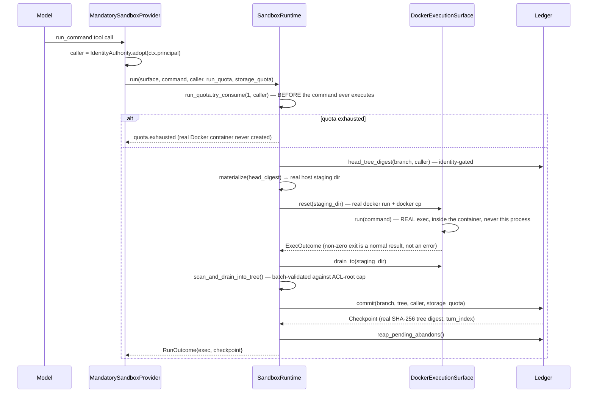
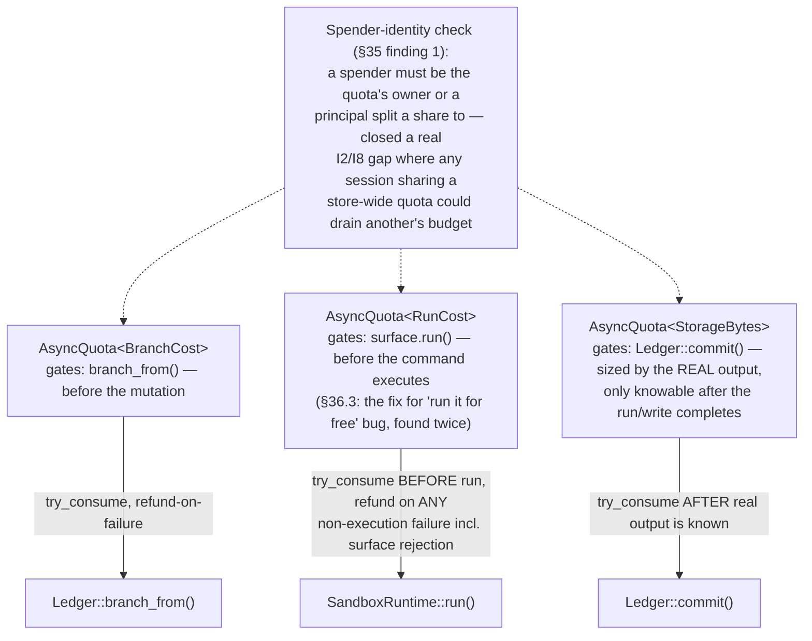
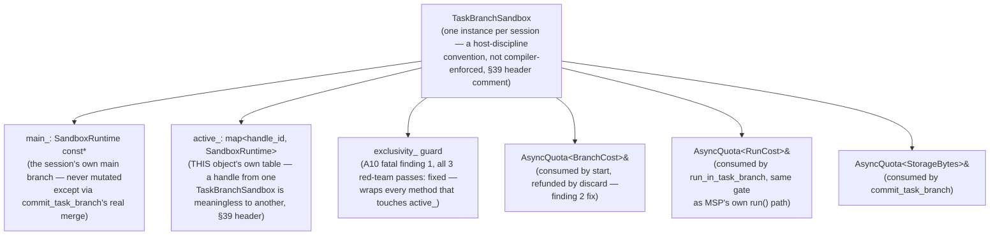
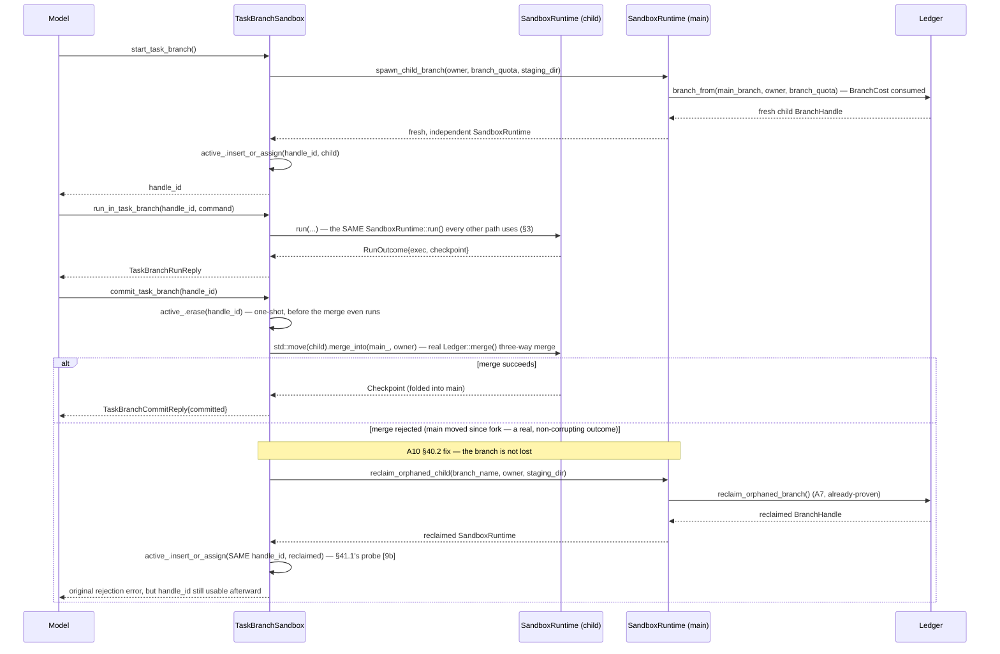
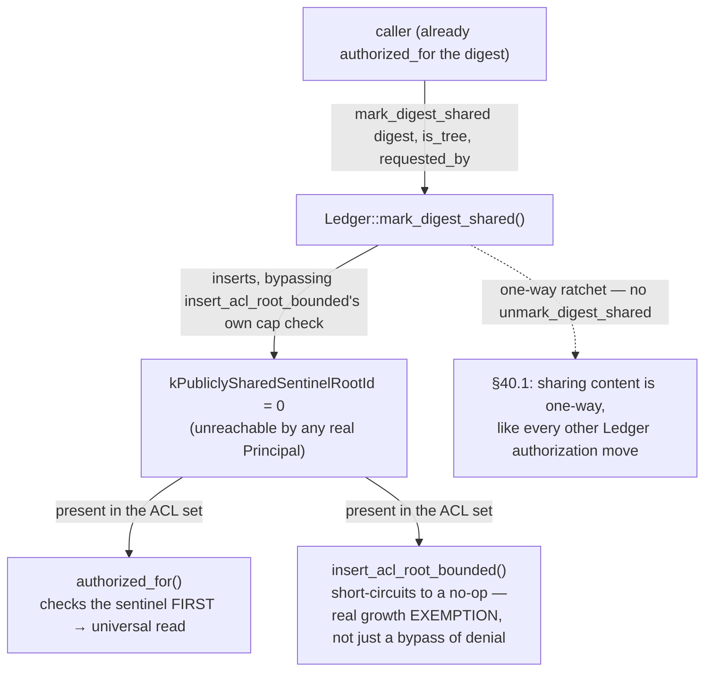
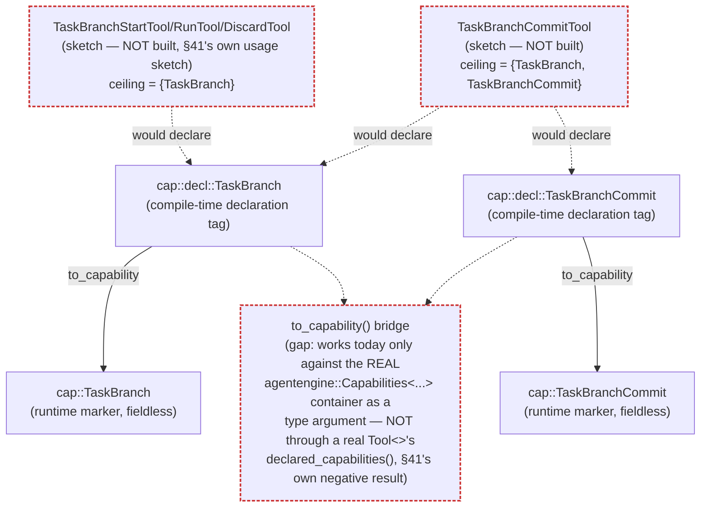
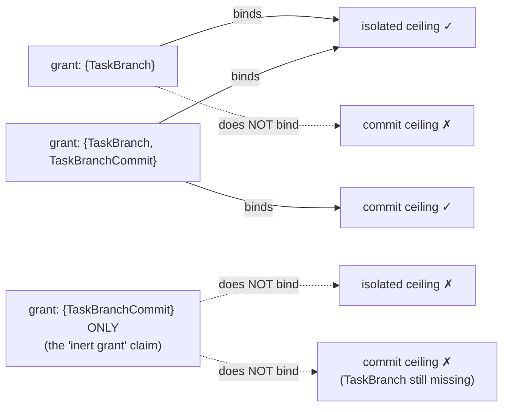

# Identity-native sandbox/worktree architecture — diagrams

Companion to `docs/planning/identity-native-sandbox-worktree-design.md` (§0–§43.5) and
`decisions/ADR-099-identity-native-sandbox-worktree-capability-model.md`. This file only
visualizes the CURRENT, converged design — it carries no new decisions. Nodes/steps marked
**(gap)** are real, named, still-open items (from §11/§34.10/§36.5/§37.5/§39.5/§40.3/§41's own
"what this does NOT close"/§42.5, or ADR-099's own residuals) — shown here so the diagrams don't
quietly imply more is settled than actually is. Sections 1–6 cover the core stack and A3/A9
(§20–§37, §5 updated 2026-08-28 to reflect §42's rollback closure); sections 7–9 (added
2026-08-28) cover A10's task-branch tool surface, its A8 fix, and the `cap::decl::TaskBranch`/
`TaskBranchCommit` capability design (§39–§41.1).

This is a **different, unrelated design** from `mandatory-session-worktree-architecture.md`
(the companion to `mandatory-session-worktree-design.md`, Design A — rejected after four
revisions, per ADR-099 §2, and kept as historical record, not updated here). Nothing in this
file reuses that design's primitives; only `WorktreeObjectStore`'s pure content-addressing is
shared, per the design doc's own §0 no-reuse framing.

## 1. Structure — what owns what

Every primitive here lives only as standalone, compiler-verified C++23 under
`docs/planning/proofs/` — **nothing on this page is linked into `include/agentengine/` yet.**
`MandatorySandboxProvider` is designed to compose as `AgentSession`'s real `HistoryProviderT`,
but has only been proven against `FakeAgentSession`, a faithful stand-in — not the real class
itself (§37.5's own disclosed gap).

```mermaid
graph TD
    IA["IdentityAuthority<br/>(bootstrap singleton, durable identity)"]
    PR["Principal<br/>(identity-only, no minting power)"]
    GR["Grant&lt;Payload&gt;<br/>(template, not a closed variant)"]
    LED["Ledger&lt;Store&gt;<br/>(default: InMemoryWorktreeObjectStore;<br/>FileWorktreeObjectStore for durability)"]
    BH["BranchHandle&lt;Store&gt;<br/>(move-only, RAII abandon-on-drop)"]
    AQB["AsyncQuota&lt;BranchCost&gt;"]
    AQR["AsyncQuota&lt;RunCost&gt;"]
    AQS["AsyncQuota&lt;StorageBytes&gt;"]
    SR["SandboxRuntime<br/>(materialize→seed→run→drain→scan→commit)"]
    ES["ExecutionSurface concept<br/>(reset/run/drain_to)"]
    DES["DockerExecutionSurface<br/>(the ONE real, compiled conformer — gap, §36.5:<br/>genericity to a native_jail-shaped<br/>backend unverified)"]
    CES["ContainerdExecutionSurface<br/>(real, standalone C++ — gap, §43.4:<br/>16 checks vs live containerd/runc,<br/>NOT yet integrated with Ledger/SandboxRuntime)"]
    MSP["MandatorySandboxProvider&lt;Surface&gt;<br/>(ContextProvider conformer)"]
    RCT["RunCommandTool<br/>(no static Capabilities&lt;&gt;, dynamic check only)"]
    AS["AgentSession&lt;ChatClientT, StateT, HistoryProviderT&gt;<br/>(gap, §37.5: never actually instantiated<br/>with MandatorySandboxProvider as the<br/>real HistoryProviderT — proven only<br/>against FakeAgentSession)"]
    TBS["TaskBranchSandbox<br/>(§39/§40, try/commit/discard —<br/>see §7 below for detail)"]

    IA -->|mints| PR
    IA -->|mints, host-only| GR
    PR -.->|scopes| AQB
    PR -.->|scopes| AQR
    PR -.->|scopes| AQS
    LED -->|issues| BH
    LED -->|content-addressing only, no capability entanglement| OBJ["WorktreeObjectStore<br/>(the ONE thing reused from Design A's world)"]

    MSP -->|owns, per session| SR
    MSP -->|owns, per session| DES
    MSP -->|consumes before running| AQR
    MSP -->|consumes at commit| AQS
    MSP -->|consumes on fork| AQB
    MSP -->|contributes, if bound| RCT
    SR -->|owns one| BH
    SR -->|drives one| ES
    DES -.->|conforms to| ES
    CES -.->|conforms to, designed only — gap| ES

    AS -.->|composed as HistoryProviderT — gap, see above| MSP
    TBS -->|takes MSP's own runtime() as main, const&, §39 header comment| MSP
    TBS -.->|constructor-injected AQB/AQR/AQS references —<br/>same instances as MSP's or separate is a<br/>host-wiring choice, not specified by this design| AQB

    classDef gap stroke:#c33,stroke-width:2px,stroke-dasharray: 4 2;
    class DES gap;
    class CES gap;
    class AS gap;
```

## 2. Session init — `bind_sandbox()`, mandatory but not compile-enforced

"Mandatory" is enforced the same way `AgentSession::initialize()` already enforces
`session_id_`/`principal_` — a host-discipline convention, not a compiler guarantee. A
default-constructed `MandatorySandboxProvider` is a well-defined, safe "no sandbox bound yet"
state (required so `clear_in_process_state()`'s real, unmodifiable `HistoryProviderT{}`
statement compiles at all) — **not** the design's own stronger §1 item 2 guarantee ("a session
with no execution capability still owns a branch"); the unbound state here owns no branch at
all **(gap, §37.5)**.

```mermaid
sequenceDiagram
    participant Host
    participant IA as IdentityAuthority
    participant L as Ledger
    participant MSP as MandatorySandboxProvider

    Host->>IA: adopt(real_principal.id, on_behalf_of)
    IA-->>Host: Principal (bridged, identity-scoped)
    Host->>L: create_root_branch(owner)
    L-->>Host: BranchHandle
    Note over MSP: default-constructed here = "no sandbox bound yet"<br/>(safe, but NOT the same as "owns a branch, no execution" — gap)
    Host->>MSP: bind_sandbox(ledger, branch, owner, staging_root,<br/>branch_quota, run_quota, storage_quota)
    MSP->>MSP: runtime_.emplace(...); surface_.emplace()
    Note over Host,MSP: mirrors AgentSession::initialize()'s own convention —<br/>a host that forgets this call gets zero execution<br/>capability, never a crash, never aliasing
```

## 3. Turn boundary — `SandboxRuntime::run()`, one call commits one turn

Unlike the earlier (also-standalone) `SandboxSession::harvest_and_checkpoint()` model (stage
writes across a turn, commit once at turn end), A3's `run()` is self-contained per invocation —
materialize, seed, run, drain, scan, commit, all in one call, gated by a **separate** `RunCost`
quota checked *before* the command executes (§36.3, the first-version-had-this-wrong finding).



## 4. `fork_from()` — every copy is self-contained, no shared mutable state

The central fix of §37.2/§37.3: the first version split fork creation into a `prepare_fork()`
step stashed in a shared, mutable member — found structurally unsound (any incidental copy
through `AgentSession::history_provider()`'s real mutable accessor could silently corrupt it).
The redesign makes every copy-assignment independently self-contained.

```mermaid
sequenceDiagram
    participant Host
    participant P as AgentSession (parent)
    participant C as AgentSession (child)
    participant SRp as SandboxRuntime (parent)
    participant L as Ledger

    Host->>C: fork_from(parent, "child-id")
    Note over C: the REAL, unmodified engine statement:<br/>history_provider_ = source.history_provider_;
    C->>C: operator=(other) — this == &other? → genuine no-op (§37.3 fix)
    alt other.runtime_ unbound
        C->>C: reset ALL fields — byte-identical to default-construction
    else
        C->>SRp: spawn_child_branch(owner, branch_quota, staging_parent_dir) [const]
        SRp->>L: branch_from(parent_branch, owner, branch_quota)
        alt BranchCost exhausted or any failure
            L-->>SRp: error
            SRp-->>C: error
            C->>C: fails closed — same state as "unbound", never aliases parent
        else
            L-->>SRp: fresh child BranchHandle (name unique via branch_seq_)
            SRp->>SRp: digest(child_branch.name()) → unique staging dir (ADR-096 C8 precedent)
            SRp-->>C: fresh, independent SandboxRuntime
            C->>C: runtime_.emplace(child); surface_.emplace()
        end
    end
    Note over Host,C: any number of forks — sequential, incidental, or concurrent —<br/>each independently succeeds or fails on its own merits;<br/>NOTHING shared between calls to race on or steal from
```

## 5. Rollback — now composed with A3/A9, quota-gated (design doc §42, 2026-08-28)

`Ledger::reset_to()` (real, checkpoint-DAG-preserving rollback, §23) is now wired to BOTH
`SandboxRuntime` (A3) and `MandatorySandboxProvider` (A9) via a real `reset_to_turn()` on each,
closing what used to be this section's own disclosed gap. `full_stack::SandboxSession::
reset_to_turn()` (§26) remains a DIFFERENT, pre-existing, unmodified composition — the two are still
never folded together (§36.1's own "never folds into the existing type" decision stands).

A red-team round on this composition found the first version took NO `AsyncQuota` at all — unlike
every other mutating verb on `SandboxRuntime` — letting a caller already holding a bound sandbox call
it for free, causing unbounded `Ledger` checkpoint growth and, under a durable `Store`, a full-ledger
re-serialize on every call. Fixed with `AsyncQuota<ResetCost>`, consumed before the mutation and
refunded on failure, proven live against a real Docker daemon at both layers (12 checks total)
including a quota-exhaustion adversarial check at each layer.

```mermaid
graph LR
    L["Ledger::reset_to(branch, turn_index, principal)<br/>real, proven, §23"] -->|wraps| SR["SandboxRuntime::reset_to_turn()<br/>(A3, §42.1 — quota-gated by<br/>AsyncQuota&lt;ResetCost&gt;, §42.2)"]
    SR -->|exposed at session level, since runtime()<br/>only ever hands back a const*| MSP2["MandatorySandboxProvider::reset_to_turn()<br/>(A9, §42.1)"]
    SSS["full_stack::SandboxSession<br/>::reset_to_turn()<br/>real, proven, §26"] -->|"a DIFFERENT, pre-existing type —<br/>never folded together, §36.1"| SR2["SandboxRuntime / MandatorySandboxProvider<br/>(a separate composition — §36.1, §37 banner)"]

    Note2["Still NOT established (§42.5): any Tool&lt;&gt;/capability-<br/>declaration story — host-level only, not model-reachable.<br/>ADR-099 §7's Ledger::reset_to() authorization residual<br/>(no authorized_for() check of its own) remains open,<br/>inherited unchanged — possession is still the whole<br/>authorization boundary here"]
    Note2 -.-> SR
    Note2 -.-> MSP2
```

## 6. Quota model — one primitive, three instantiations, three distinct gates



## 7. A10 — `TaskBranchSandbox`: try/commit/discard on the SAME `Ledger`/`SandboxRuntime`

The primary mechanism every actively-developed coding agent surveyed ships (§39.1's own
real-world-use-case research citation): fork an isolated child branch, run in it, then either fold
it into main or throw it away — matching `RunShellTool`/`SessionShellSandbox`'s own real, shipped
shape (`src/backends/native_jail/`), not a new pattern invented for this design. `main_` is the
SAME `SandboxRuntime const*` `MandatorySandboxProvider::runtime()` already, deliberately, hands
back (§37) — no new accessor was needed on that class.





## 8. A8 — the ACL cap's escape hatch, a one-way sharing ratchet

`Ledger`'s per-digest ACL root cap (`kMaxAclRootsPerDigest`, default 64) was originally a PERMANENT,
non-evictable ceiling — cross-session sharing of a common base could exhaust it forever, with no
recovery (§40.1's own "worse than disclosed" finding). Fixed with a per-instance constructor
parameter plus `mark_digest_shared()`, gated by the SAME `authorized_for()` check every ordinary
read already uses, and a reserved sentinel principal id (`kPubliclySharedSentinelRootId = 0`,
confirmed unreachable by any real principal — `IdentityAuthority` mints starting at 1).



## 9. `cap::decl::TaskBranch`/`TaskBranchCommit` — capability gating (prove-phase only, §41/§41.1)

Closes A10's own finding 4: no capability-declaration design existed for who may call these four
verbs at all. Two tags, not one — `TaskBranch` gates start/run/discard (isolated, never touches
main); `TaskBranchCommit`, required ADDITIONALLY, gates commit (merges into main). Built entirely
under `docs/planning/proofs/` — the real `agentengine::Capability` variant is closed (19
alternatives, none named `TaskBranch`) and this design track declines to extend it before a real
caller exists (§41's own scope statement).



**Gating behavior, executed not just asserted (§41.1)** — a structural mirror of the real
`CapabilitySet::contains()`/`bind()` and the real `tool_pipeline.hpp` step-4/7 loop, run against
the two ceilings above, 12/12 checks:



## Status legend

- Solid, no note → real primitive, already implemented as standalone C++23 and proven by a real
  probe compiled with `clang 22.1.5`/`-std=c++23` and run to completion (including, for A3/A9/A10,
  live against a real Docker daemon; for the §9 capability-gating mirror, run to 12/12 green rather
  than against a daemon) — see the design doc's own §20–§42.5 for the exact evidence per primitive.
- **(gap)** annotations → open findings named in §11, §34.10, §36.5, §37.5, §39.5, §40.3, §41's own
  "what this does NOT close", or ADR-099's own residuals — not fixed, not hidden. See the design
  doc / ADR for the full text of each. Two gaps sections 7–9 add: `TaskBranchSandbox` requires one
  instance per session, a host-discipline convention (not compiler-enforced, matching
  `MandatorySandboxProvider::bind_sandbox()`'s own precedent — §39 header comment); and
  `ContainerdExecutionSurface` (the second `ExecutionSurface` conformer added to §1's
  structure diagram, design doc §36.5/§43.4) now has real, standalone C++ (16 checks against live
  containerd/runc) but is not yet integrated with the real `Ledger`/`SandboxRuntime` stack — the
  §1 diagram's own gap marking now means "not yet composed with the rest of this stack," not
  "no code exists."
- **Nothing on this page is implemented in `include/agentengine/`/`src/` today.** Every type
  shown lives only under `docs/planning/proofs/`, deliberately never linked into the live
  engine — this design has completed design → red-team → prove (multiple rounds each for the
  core primitives, A3, and A9) but has **not** been Judged (`decisions/ADR-099` is Proposed,
  not Judged) and has not begun implementation.
- Reconciliation with the three real, already-shipped mechanisms occupying overlapping territory
  (`SandboxToolProvider`/`decisions/ADR-096`, `CodeActRunnerBinding`/`decisions/ADR-030`, the
  zero-consumer `SandboxBackendRegistry`/`decisions/ADR-080`/`ADR-098`) is deliberately not
  shown here — per explicit project-owner direction, this design was built fresh rather than
  designed around reuse; reuse-vs-replace against those is an implementation-time decision, not
  a design-time one.
