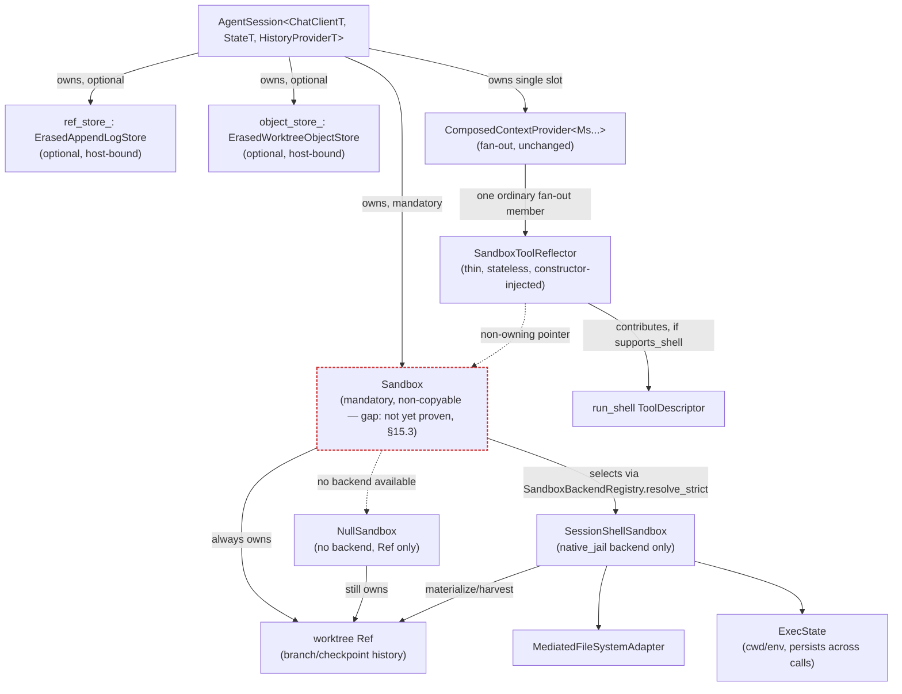
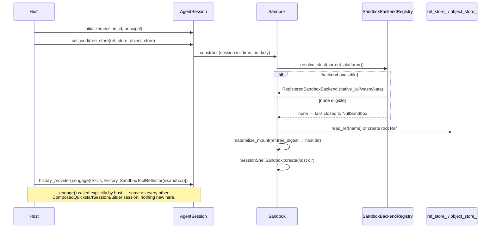
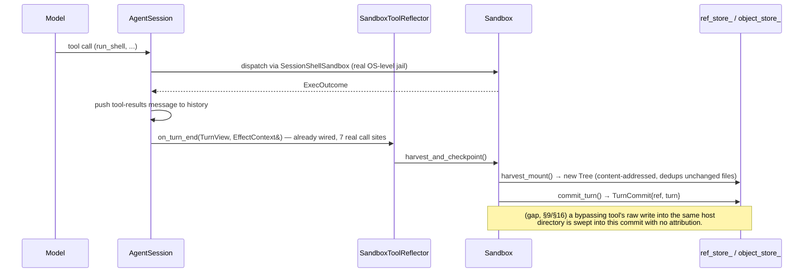
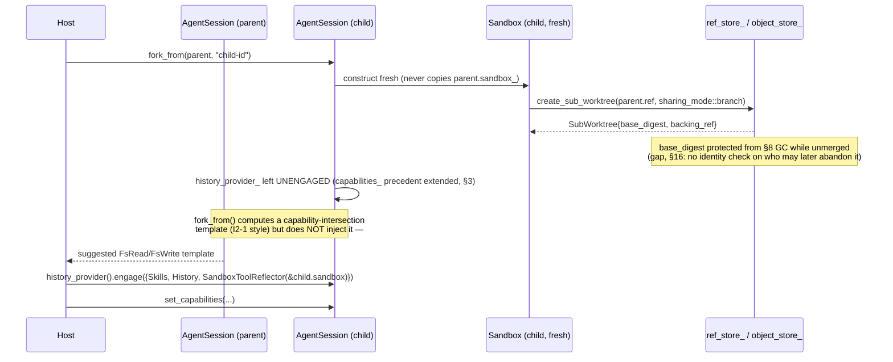
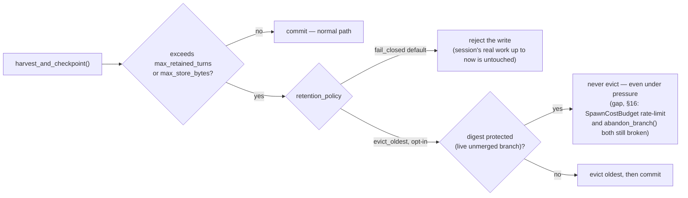

# Mandatory session-worktree architecture — diagrams

Companion to `docs/planning/mandatory-session-worktree-design.md` (Revision 4, §1-§16). This file
only visualizes the CURRENT design — it carries no new decisions. Nodes/steps marked **(gap)** are
real, open findings from §14/§16's red-team rounds, not yet resolved; shown here so the diagrams
don't quietly imply more is settled than actually is.

## 1. Structure — what owns what

`Sandbox` is `AgentSession` structure (like `Principal`), not a `ContextProvider`. Only the thin
reflector sits inside the composed provider fan-out, and it owns nothing — just a pointer.



## 2. Session init — materialize once



## 3. Turn boundary — commit is unconditional



## 4. `fork_from()` — branch, don't rebuild

The central fix across Revisions 2→3: `fork_from()` never tries to rebuild the composed provider.
It only prepares a fresh `Sandbox`; the host re-`engage()`s afterward, exactly like initial setup.



## 5. Rollback — `reset_to_turn`

```mermaid
sequenceDiagram
    participant Caller
    participant SB as Sandbox
    participant Store as ref_store_
    participant Shell as SessionShellSandbox

    Caller->>SB: reset_to_turn(turn_index)
    Note over SB: (gap, §15.1/§16) capability check ambiguous —<br/>cap::SandboxReset vs. Tool&lt;&gt;'s own static declaration unreconciled
    SB->>Store: rewind_to_turn(ref_name, turn_index)
    Store-->>SB: TurnCommit{new head = old digest} (history never erased, only moved forward)
    SB->>Shell: remove_all(host dir)
    Note over Shell: (gap, §9/§16) races a bypassing tool's still-open handle
    SB->>Shell: materialize_mount(target digest → host dir)
    SB->>Shell: reset_exec_state()
    Note over Shell: (gap, §7/§14) method doesn't exist on the real class yet
```

## 6. Storage-growth policy (§8)



## Status legend

- Solid, no note → real primitive, already shipped and tested (`create_sub_worktree`,
  `rewind_to_turn`, `materialize_mount`/`harvest_mount`, `on_turn_end`'s 7 wired call sites,
  `SandboxBackendRegistry.resolve_strict`).
- **(gap)** annotations → open findings from the design's own red-team rounds (§14, §16) — not
  fixed, not hidden. See `mandatory-session-worktree-design.md` for the full text of each.
- Nothing in this diagram is implemented in `AgentEngine` source today — `Sandbox`, `SandboxToolReflector`,
  `ErasedAppendLogStore`/`ErasedWorktreeObjectStore`, `reset_to_turn`, `abandon_branch`, and
  `cap::SandboxReset` are all design-only as of this writing.
